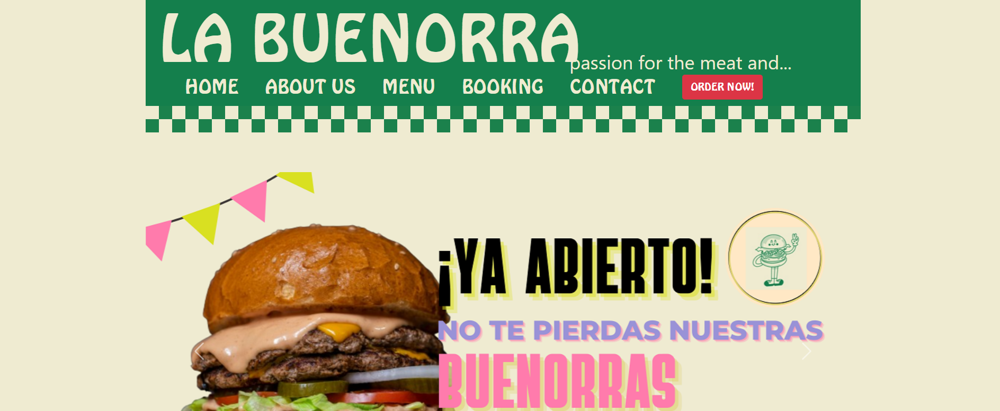

# La Buenorra Web English Project DAW

Pagina web creada para un projecto de ingles en el grado superior de DAW primer año.

## Authors

- [@adriaansaeez](https://www.github.com/adriaansaeez)

## Acknowledgements

 - [IgFormacion temario](https://igformacion.online/)
 - [Bootstrap Info](https://getbootstrap.com/docs/5.0/getting-started/introduction/)
 - [How to write a Good readme](readme.so)

## Color Reference

| Color             | Hex                                                                |
| ----------------- | ------------------------------------------------------------------ |
| Color Principal |  #147f4c |
| Color Secundario |  #efebd1 |
| Botones |  #bb2d3b |
| Enlaces |  #3143ac |

## Tech Stack

**Client:** HTML5, CSS, Bootstrap 5.0

## Screenshots

## Roadmap

- Additional browser support

- Add more integrations

- Hacerla mas comercial

- Añadir mas paginas

- Base de datos de clientes

